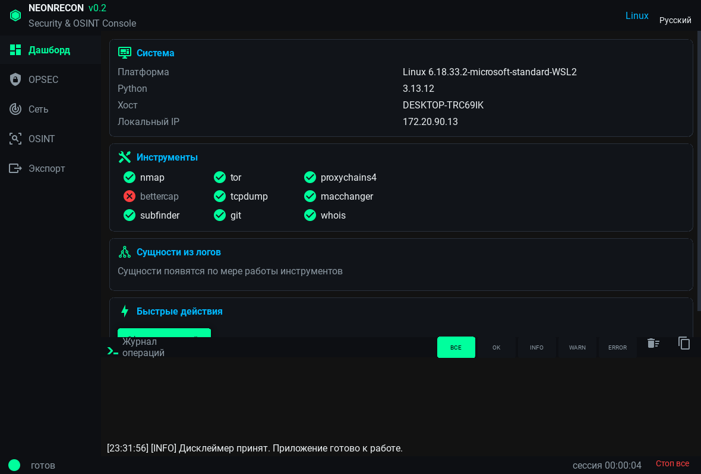

# Universal Security & OSINT Assistant

Кроссплатформенное Python-приложение с графическим интерфейсом для легального аудита безопасности систем и OSINT-разведки.



**Скачать Android APK:** [Releases → NeonRecon.apk](https://github.com/bimpiRU/NeonRecon/releases/latest)

## ⚠️ Дисклеймер

См. [DISCLAIMER.md](DISCLAIMER.md). Использование ПО допускается только на собственных системах или с письменного разрешения владельца. Разработчик не несёт ответственности за неправомерное использование.

## Возможности

- **Дашборд (Maltego-style):** сводка о системе, матрица доступности инструментов, автоматическое извлечение сущностей из логов (IP, домены, e-mail, телефоны), быстрые действия.
- **OPSEC:** смена hostname/MAC, запуск Tor + proxychains.
- **Сетевой аудит:** тихий nmap, пассивный MITM-анализ (bettercap/tcpdump), аудит МФУ через PRET.
- **OSINT:** DNS history, Wayback Machine, сбор поддоменов (subfinder), phone lookup.
- **Экспорт:** локальный отчёт `FINAL_REPORT.txt`, подготовка git-синхронизации.

## Что нового в v0.2

- **5 языков интерфейса** (RU / EN / ES / DE / ZH) с переключением на лету и сохранением выбора.
- **Стабильность:** реестр фоновых задач, отмена всех задач одной кнопкой (kill всей группы процессов), таймауты, crash-handler с записью в `~/neonrecon_crash.log`.
- **Журнал операций:** цветные уровни, фильтры (ВСЕ/OK/INFO/WARN/ERROR), очистка и копирование в буфер.
- **Статус-бар:** счётчик активных задач, таймер сессии, кнопка «Стоп все».
- **UX:** дисклеймер показывается один раз (согласие сохраняется в `~/.usosint/config.json`).

## Поддерживаемые платформы

- **Kali Linux / Debian / Ubuntu** — полная функциональность (при наличии root и инструментов).
- **Windows** — ограниченная функциональность; внешние утилиты должны быть установлены отдельно.
- **Android** — демонстрационный режим для большинства инструментов; требуется сборка через Buildozer.

## Развёртывание на Kali Linux

### 1. Установка системных зависимостей

```bash
sudo apt update
sudo apt install -y python3-pip python3-venv git nmap tor proxychains4 bettercap tcpdump macchanger
```

### 2. Установка subfinder

```bash
sudo apt install -y subfinder
```

### 3. Установка PRET

```bash
cd /opt
sudo git clone https://github.com/RUB-NDS/PRET.git
sudo pip install -r PRET/requirements.txt
sudo ln -s /opt/PRET/pret.py /usr/local/bin/pret
```

### 4. Установка Python-зависимостей

```bash
cd UniversalSecurityOSINTAssistant
python3 -m venv venv
source venv/bin/activate
pip install -r requirements.txt
```

### 5. Запуск

```bash
python main.py
```

Для полноценного использования функций смены MAC/hostname и SYN-сканирования запускайте с правами root:

```bash
sudo ./venv/bin/python main.py
```

## Сборка Android .apk через Buildozer

### 1. Установка зависимостей сборки

```bash
sudo apt update
sudo apt install -y git zip unzip openjdk-17-jdk python3-pip autoconf libtool pkg-config zlib1g-dev libncurses5-dev libncursesw5-dev libtinfo5 cmake libffi-dev libssl-dev
pip install buildozer cython
```

### 2. Сборка APK

```bash
cd UniversalSecurityOSINTAssistant
buildozer -v android debug
```

Готовый APK появится в директории `bin/`.

### 3. Установка на устройство

```bash
buildozer android deploy run
```

## Структура проекта

```
UniversalSecurityOSINTAssistant/
├── main.py              # Точка входа
├── requirements.txt     # Python-зависимости
├── buildozer.spec       # Конфигурация сборки Android
├── DISCLAIMER.md        # Юридический дисклеймер
├── README.md            # Этот файл
├── usosint/
│   ├── app.py           # Корневой виджет
│   ├── ui/              # Компоненты интерфейса (дашборд, вкладки, журнал, виджеты)
│   ├── core/            # Логгер, executor, i18n, конфиг, буфер обмена, платформа
│   └── modules/         # Функциональные модули
```

## Лицензия

Проект распространяется как есть (AS IS) исключительно в образовательных целях.
